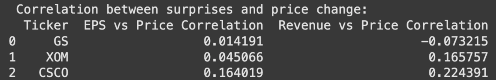
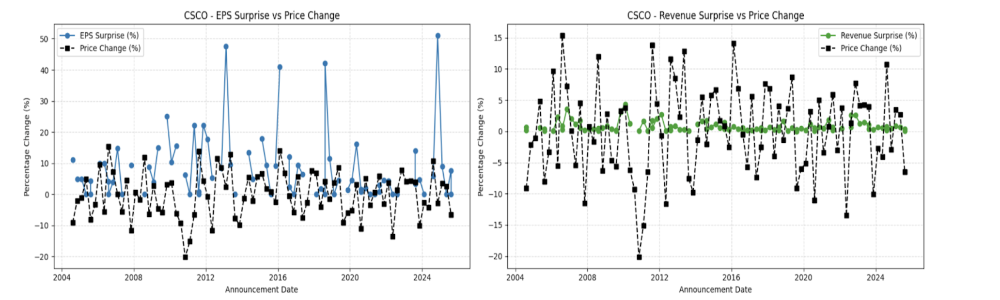
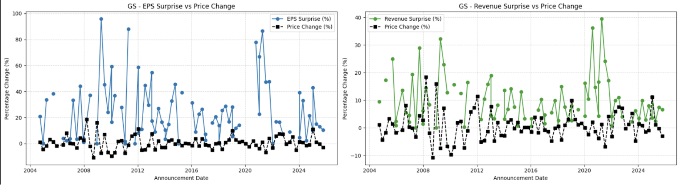
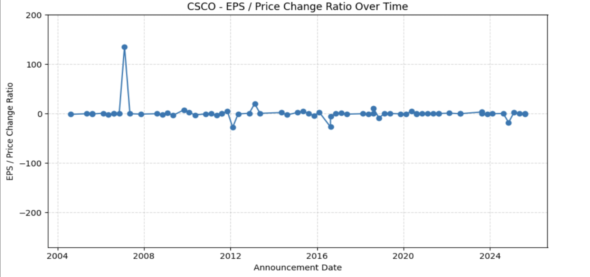
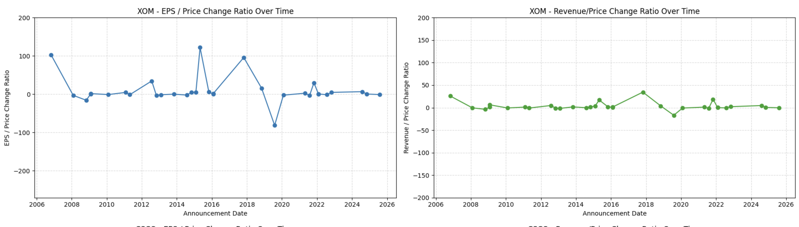
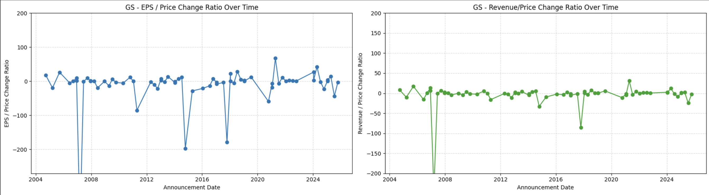
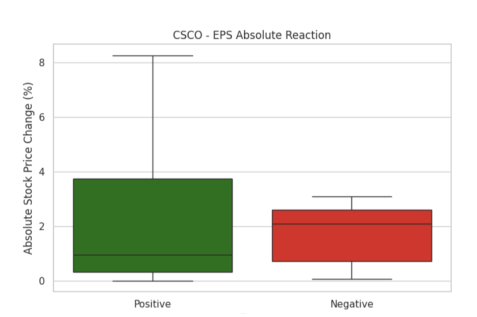
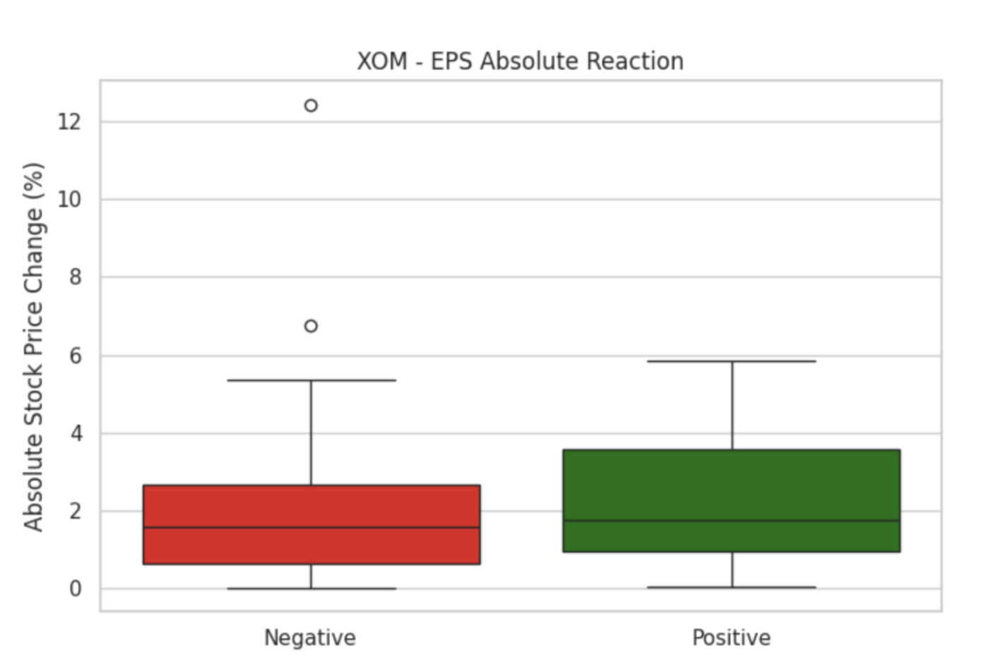
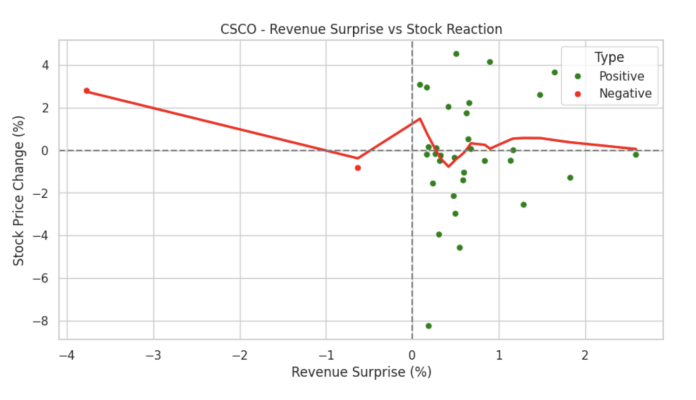

# NYU-Databootcamp-Midterm
# Earnings Estimates Impact on a Stock’s Trading Price
**By Sampreet Bheemireddy, Vihan Agrawal, and Jai Wadhwan**

**Project Overview:** In our exploratory data analysis, we underwent a project that included data from yahoo finance to track stock prices over time, SEC filings to understand when earnings releases went public, and consensus data from Capital IQ to see whether a company exceeded or did not meet their expectations during a fiscal quarter or year. The purpose of the project was to better understand how to react to earnings releases in terms of positioning in stocks. If there is a positive earnings release that beats expectations, does this necessarily mean that the price of a stock will increase? We wanted to explore questions such as these to see what it means when reading a 10-K or 10-Q and seeing that a company either exceeded or did not meet the expectations. We also looked at different metrics that Capital IQ sets expectations for, namely earnings per share (EPS) and revenue, to see if there are certain metrics that have greater of an impact than others. We looked at three companies across different industries. Goldman Sachs (NYSE:GS), Exxon Mobil Corporation (NYSE:XOM), and Cisco Systems, Inc (NASDAQ: CSCO). The reason for choosing these companies was to see if various industries have different reactions to earnings surprises. Being in the banking, fuel and oil, and technology industries respectively, they have very different sources of revenue and business models. We chose to analyze stock prices 7 days after the release of financial statements, as this gives a slightly larger window to see true impact rather than within two days of a release, as price tends to shift in whatever direction the surprise was in. 

**Why this is a Compelling Project:** This project stuck out to us because we wanted to analyze the significance of earnings reports like 10-Ks and 10-Qs. People often seem to overreact to news related to a company's financial metrics. This could be in either direction: panicking when negative and being overly optimistic when positive. Researching estimate surprises provides insight into whether decisions should be made based off of SEC filings or if these do not have a significant impact in the long run. We wanted to research if beating expectations automatically moves stock prices or vice versa.

**How we Collected our Data:** In order to collect all of the information and data we needed, we used multiple different tools. First, in order to collect data for financial estimates, the actual values, and the percentage difference between the two, we used data from Capital IQ’s estimates surprise tab. We downloaded this data into a xls file and manipulated the data to only include the metrics we needed. Next, we used an API from the Securities and Exchange Commission to scrape all of the 10-K and 10-Q filings for GS, XOM, and CSCO and took the data we needed such as filing date, form type, and total filings. Lastly, we used the Yahoo Finance python library to access stock price data at certain dates. For the companies we chose, we created a merged data frame that linked stock price changes 7 days after the SEC filings were released. 

**Places of Trouble:** There were a couple of issues we ran into while collecting our data. First, for Goldman Sachs, the earnings expectations surprise release dates and SEC filings did not release during a 1 week period, but instead within a 3 week period. This means our data for Goldman Sachs may be slightly skewed. Furthermore, there were pieces of missing data in the collected data from Capital IQ, meaning we had to manipulate the data before reading it into data frames.

**Experimental Question #1:** The first question we analyzed is whether EPS expectation surprises or revenue expectation surprises have the strongest correlation with stock price change? This question is especially significant because it provides information on whether certain metrics are more closely linked to changes in stock price.

From these statistics, you can see that on average, revenue has a stronger correlation with stock price with an average correlation of 0.181 while EPS has an average correlation of .0637. The strong total correlation throughout all three companies and both metrics in between revenue and price for Exxon Mobil. Between Revenue, and EPS , it would be more reliable to expect stock price behavior after a revenue earnings surprise.

When looking at the two metrics for Cisco, revenue has much less volatility, while EPS surprise tends to vary by large amounts over time. 

Analyzing the metrics for GS, they have a much higher variance in both metrics compared to Cisco. We believe this is due to how highly tied the banking industry is to macroeconomic events and big transactions. One large event during a fiscal quarter could throw off revenue and cause expectations to be off. For a company like Cisco, they are most likely much less dependent on macroeconomic events.

Furthermore, the slope of each metric compared to stock price changes is less than one, showing that stock price does not change as much as earnings are missed or exceeded by. A large earnings surprise may not correlate to a large shift in stock price.

**Experimental Question #2:** The next question we explored is how do estimate surprise metrics over time correspond to changes in stock price? Does this vary by industry? We wanted to explore whether the impact of earnings surprises changes over time, or if it remains constant. 

When looking at Exxon Mobil’s, Goldman Sachs’, and Cisco System’s ratios of EPS surprise % / price change %, Goldman Sachs has a much more volatile ratio over time. When looking at this statistic over time, it is clear that it fluctuates on occasion, but remains relatively constant for most companies. For Cisco Systems, there is a mostly constant ratio between EPS surprises and stock price change. For Exxon, it is slightly harder to predict if stock price would go up or down after a positive or negative surprise change, and by what amount because there are large negative and positive ratios. This means that sometimes the stock price of XOM changes greatly in both the same direction and opposite direction of the EPS surprise. This data shows that in some industries such as gasoline and fuel, predicting stock price changes based on surprises after earnings releases may be difficult. Industries such as technology seem to be much easier to predict based on earnings surprises. In order of prediction ability, Cisco is the easiest, then Exxon, followed by Goldman. Goldman has many instances of having large negative ratios, showing that a positive earnings surprise may actually result in a decrease in stock price and vice versa.

**Experimental Question #3:** The third question we explored is whether the market reaction is symmetric — are negative surprises punished more than positive surprises rewarded? The purpose of this question is to understand whether the direction of the surprise is an indicator of how the stock will react. 

When analyzing these box plots, you see for a company such as Cisco, positive EPS reactions have a relatively wider range of related stock price changes as well as a higher median for absolute stock change. However, when looking at how revenue impacts absolute stock price change, the ranges are similar for positive and negative surprises. Still, the median change is higher for a positive surprise. For this company, a positive earnings expectation surprise may lead to larger absolute changes in stock price in the following time period. 

This trend seems to continue for Exxon Mobil as well. Positive EPS surprises have a larger total effect and range of reactions. This shows that companies are not punished as much for not meeting their earnings expectations, but rather are rewarded when they exceed their expected earnings per share after the release of a SEC filing. 

**Experimental Question #4:** The final question we posed is whether there is a nonlinear relationship between surprise size and stock price reaction? Are there diminishing marginal reactions to very large surprises? We wondered whether large enough surprises would cause a lower relative shift in stock price. 

Looking at the line of best fit for CSCO’s  revenue surprise vs stock price change, it is mostly linear, but has a negative slope. This shows that even after negative surprises, the price change in the stocks doesn’t change as much as it does for positive surprises, meaning that positive surprises have a much higher impact relative to negative. What is interesting about this data is that there is an upwards spike when revenue surprise is approaching zero, showing that when Cisco meets their expectations exactly, their stock price is rewarded in the market.

**Evidence-based Conclusion:** After collecting, manipulating, and analyzing our data, we have come to the conclusion that predicting the direction of stock prices based off of earnings surprises after the release of SEC filings is extremely unlikely as well as unreliable. However, when looking at companies that may be more stable over time such as technological companies like Cisco, it may be a reasonable assumption to believe that stock price will move in the direction of the earnings surprise.

 A reason we believe this is the case is because of the magnitude of private information that is accessible to large firms and banks. This ensures that the average investor is much less informed than necessary. By the time a 10-K or 10-Q is released, the market as a whole may have already accounted for whether a company is going to hit or miss their estimates because large firms control a large portion of the market. The common person will always be greatly disadvantaged compared to the firms with more information, so trying to use earnings releases is not a viable option because the window of opportunity most likely has already closed. Furthermore, it can be seen from the weak correlation, and often negative ratio between estimate surprises and stock price changes that there is little evidence for differences between expected and actual earnings to have a strong relationship to how a stock price will change. 

Also, reactions from earnings surprises are also very extremely industry dependent. For instance, the technology sector, Cisco, exhibited weaker price sensitivity and volatility to surprises, while the financial sector, Goldman Sachs appeared more influenced by broader macroeconomic factors like the 2008 housing crisis. Also, the fuel and oil industry is extremely volatile by nature, making missing and exceeding earnings expectations very cyclical, and thus unpredictable. This makes generalized conclusions based on earnings surprises to be inaccurate, and one must do more research when making an investment decision after the release of earnings statements and SEC filings. Stock prices can change even when a company meets their earnings expectations as well, further showing how earnings expectations are not necessarily a marker of how the market for a stock will behave in the near future. Originally, we believed that there would be a strong correlation between earnings surprises and stock prices, making predictions after the release of an SEC filing easier, but this is not the case.
